# 谷粒商城分布式基础篇一

## **微服务架构图**


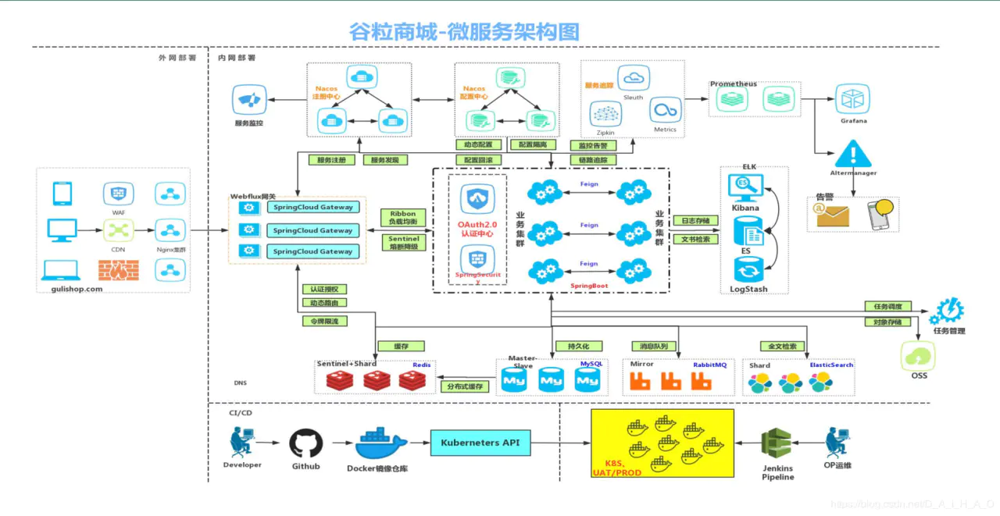


## **微服务划分图**


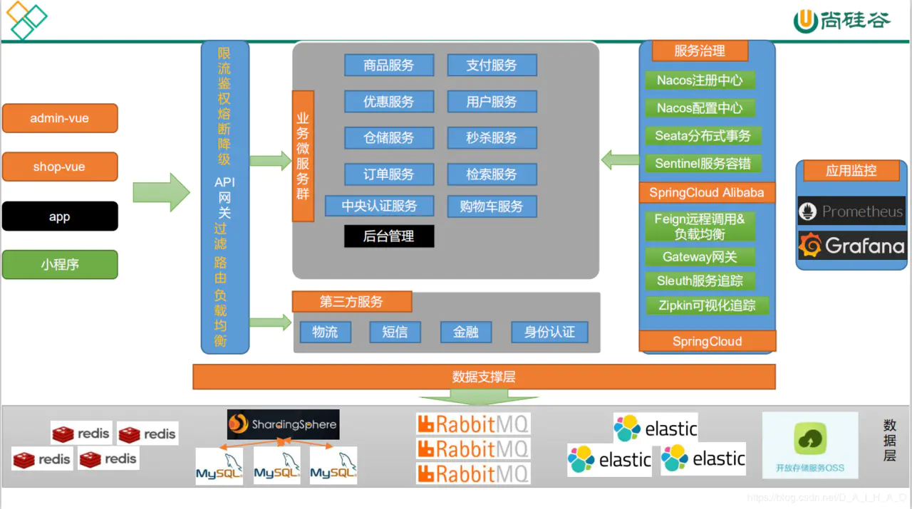


## 搭建虚拟开发环境

1. [下载安装VirtualBox](https://www.virtualbox.org/wiki/Downloads) [下载安装Vagrant](https://www.virtualbox.org/wiki/Downloads) 

2. 安装好后，在合适的目录，创建一个存放vagrant box的目录，方便日后统一管理（此处的目录请以英文命名，否则编码出错）

   ```shell
   $ mkdir ./centos7
   ```

3. 因为`vagrant up`下载BOX文件实在太慢，建议：

   1. `vagrant init centos/7`

   2. `vagrant up`观察下载的版本号以及BOX文件的地址

      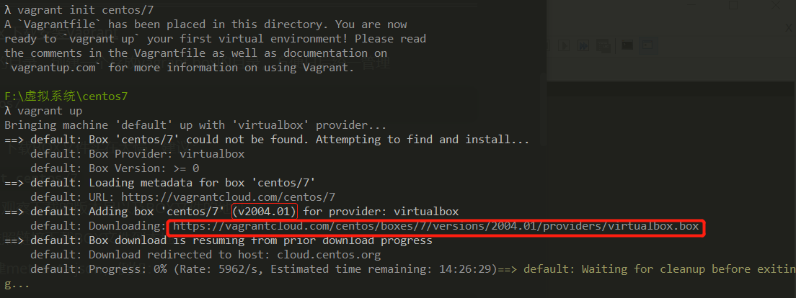

   3. ctrl+C中断并依照链接下载BOX文件到本地

   4. 依据版本号创建metadata.json，例如：

      ```json
      {
          "name": "centos/7",  
          "versions": [{
              "version": "2004.01",  # version
              "providers": [{
                  "name": "virtualbox",
                  "url": "./CentOS-7-x86_64-Vagrant-2004_01.VirtualBox.box"  # box address
              }]
          }]
      }
      ```
      


4. 启动虚拟机 默认密码vagrant

   ```shell
   $ vagrant up
   ```

5. 其他命令

   ```shell
   # 自动使用vagrant用户连接虚拟机 
   $ vagrant ssh 
   # 退出这台虚拟机
   $ exit
   # 停止这台虚拟机
   $ vagrant halt
   # 销毁这台虚拟机
   $ vagrant destroy
   ```

   默认虚拟机的ip不是固定的，为了开发方便，对其进行修改 在Vagrantfile中修改：

   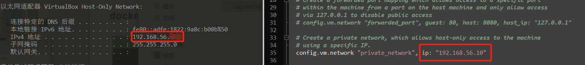

   使用`vagrant reload`重启机器并使用`vagrant ssh`连接

   尝试在外面的系统`ping`centos，在centos`ping`外面的系统，均可通信即可。


**使用Docker技术**

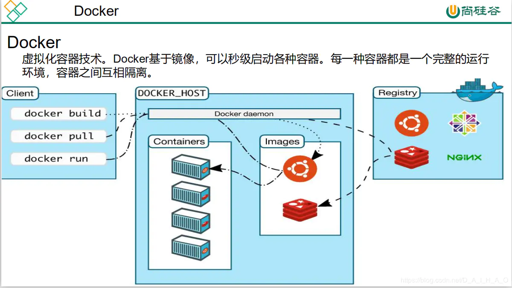

完全根据[docker的Doc](https://docs.docker.com/engine/install/centos/)安装

1. 卸载原安装的docker

   ```shell
   $ sudo yum remove docker \
                     docker-client \
                     docker-client-latest \
                     docker-common \
                     docker-latest \
                     docker-latest-logrotate \
                     docker-logrotate \
                     docker-engine
   ```

2. 更换为aliyun的镜像（CentOS7）

   ```shell
   curl -o /etc/yum.repos.d/CentOS-Base.repo https://mirrors.aliyun.com/repo/Centos-7.repo
   ```
   
3. 安装yum-utils依赖并设置存储库

   ```shell
   $ sudo yum install -y yum-utils
   
   $ sudo yum-config-manager \
       --add-repo \
       https://download.docker.com/linux/centos/docker-ce.repo
   ```

4. 安装docker

   ```shell
   $ sudo yum install docker-ce docker-ce-cli containerd.io
   ```

5. 配置docker使用[aliyun的加速器](https://cr.console.aliyun.com/cn-hangzhou/instances/mirrors)，第一次使用需要注册并填写个人信息

   ```shell
   $ sudo mkdir -p /etc/docker
   $ sudo tee /etc/docker/daemon.json <<-'EOF'
   {
     "registry-mirrors": ["https://kwtuqknp.mirror.aliyuncs.com"]
   }
   EOF
   $ sudo systemctl daemon-reload
   $ sudo systemctl restart docker
   ```

6. 设置为开机自启动

   ```shell
   # 查看docker版本
   $ sudo docker -v
   # 开机自启动
   $ sudo systemctl enable docker
   # 查看已部署的镜像：空
   $ sudo docker images
   ```

   

#### MySQL容器的部署

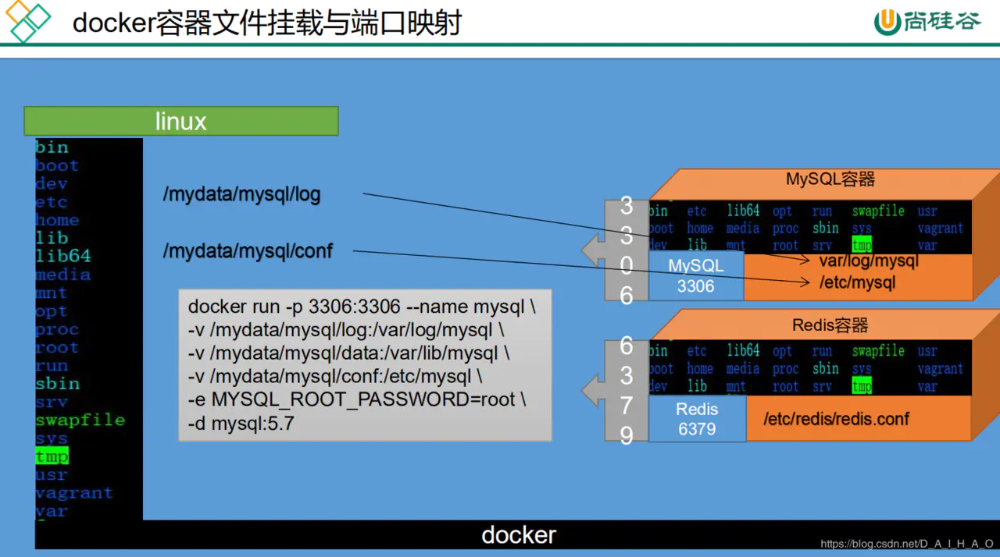

1. 安装MySQL，所有容器都是在Docker Hub的镜像下载

   ```shell
   # 下载MySQL镜像 默认拉取最新版本
   # $ docker pull mysql
   # 下载指定版本镜像
   $ sudo docker pull mysql:5.7
   # 查看镜像
   $ sudo docker images
   
   # 安装MySQL容器，docker容器文件挂载和端口映射
   # -p 代表端口映射(宿主机映射端口:容器运行端口): 3306是MySQL容器的MySQL端口，端口映射之后可以在centos的3306端口访问到MySQL容器的3306端口，进而访问MySQL
   # -v 将主机目录挂载到容器: 挂载使我们在centos也可以访问MySQL容器的log文件、配置文件、数据文件等，无需每次管理MySQL容器都进入环境，方便管理
   # -e 代表添加环境变量  MYSQL_ROOT_PASSWORD是root用户的登陆密码
   # -d 后台运行容器，并返回容器ID
   $ sudo docker run -p 3306:3306 --name mysql  -v /mydata/mysql/log:/var/log/mysql  -v /mydata/mysql/data:/var/lib/mysql  -v    /mydata/mysql/conf:/etc/mysql  -e MYSQL_ROOT_PASSWORD=root  -d mysql:5.7
   # 查看docker进程
   $ sudo docker ps
   # 交互模式(exec -it) 进入MySQL容器
   $ sudo docker exec -it mysql /bin/bash
   # MySQL容器也是一个Linux环境
   $ ls /
   # exit
   $ exit
   # 登陆mysql
   # $ mysql -u root -p
   ```

2. 可以查看的挂载文件

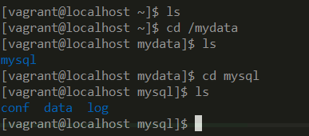

3. 修改MySQL容器的编码配置

   ```shell
   # 进入到conf文件夹
   $ cd /mydata/mysql/conf
   # 创建my.cnf并配置文件
   $ sudo vi my.cnf
   ```

   my.cnf配置：

   ```cnf
   [client]
   default-character-set=utf8
   
   [mysql]
   default-character-set=utf8
   
   [mysqld]
   init_connect='SET collation_connection = utf8_unicode_ci'
   init_connect='SET NAMES utf8'
   character-set-server=utf8
   collation-server=utf8_unicode_ci
   skip-character-set-client-handshake
   skip-name-resolve
   ```

4. 检查my.cnf是否映射到MySQL容器

   ```shell
   # 配置之后重启MySQL
   $ sudo docker restart mysql
   # 交互模式进入MySQL
   $ sudo docker exec -it mysql /bin/bash
   # 由'/mydata/mysql/conf:/etc/mysql'可知：my.cnf在MySQL容器的/etc/mysql
   $ cd /etc/mysql
   # 查看my.cnf
   $ more my.cnf
   ```

   

#### Redis部署

```shell
# 下载镜像文件
$ docker pull redis
# 查看是否安装
$ docker images
# 创建目录和redis配置文件(redis中默认没有redis.conf，直接挂载会让系统创建问价夹)
$ mkdir -p /mydata/redis/conf
$ touch /mydata/redis/conf/redis.conf
# 安装redis，文件挂载和端口映射
$ docker run -p 6379:6379 --name redis -v /mydata/redis/data:/data -v /mydata/redis/conf/redis.conf:/etc/redis/redis.conf -d redis redis-server /etc/redis/redis.conf
# 使用redis镜像执行redis-cli命令连接
$ docker exec -it redis redis-cli
# redis的数据不能持久化
$ set a b
$ get a
"b"
# 重启redis，数据会消失
$ sudo docker restart redis
$ get a
(nil)
```

2. 编辑redis.conf添加配置使redis持久化

   ```shell
   appendonly yes
   ```

   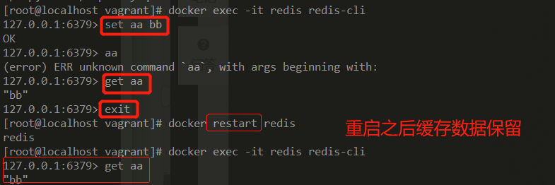
   
3. redis.conf可设置的所有配置，查询官网->documentation->configuration->version，[v6.0](https://raw.githubusercontent.com/redis/redis/6.0/redis.conf)

   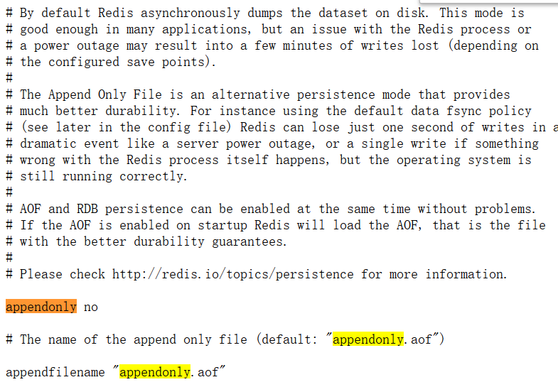

   可知appendonly默认取消配置，数据只读进内存，不存进硬盘

   

## 开发环境准备

1. java版本1.8

2. maven版本3.6.1

3. maven的设置文件(conf/settings.xml)，配置aliyun镜像，profile jdk1.8的依赖

4. 在IDEA下载plugins：Lombok和MybatisX（与free mybatis plugin冲突，二选一）

5. 下载并安装VSCode

6. 并安装如下拓展：（打马赛克的不用下）

   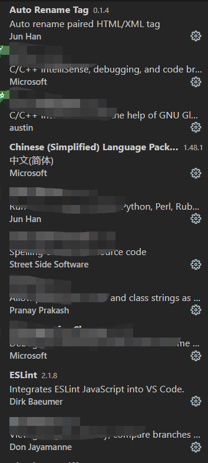

   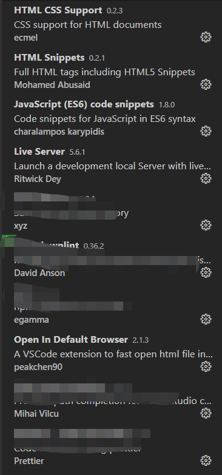

   

   7. 注册github或者码云，并安装配置好Git
   8. 

## 数据库数据初始化

资料-百度云 链接：[pan.baidu.com/s/1ftzBq3p-…](https://pan.baidu.com/s/1ftzBq3p-SNtIWNq4YWZH-g) 提取码：9tdf

## 使用人人开源搭建后台管理系统

前后端分离项目，需要先部署好后端，再部署前端页面。

后端部署： 1、通过 git ，下载renren-fast源码

```
git clone https://gitee.com/renrenio/renren-fast.git
```

2、创建数据库 renren_fast ，数据库编码为 UTF-8 3、执行 doc/db.sql 文件，初始化数据（默认支持MySQL） 4、修改 application-dev.yml ，更新MySQL账号和密码 5、运行 io.renren.RenrenApplication.java 的 main 方法，则可启动项目

前端部署： renren-fast-vue基于vue、element-ui构建开发，实现renren-fast后台管理前端功能，需要安装nodejs，常见错误看另外一篇[文章](https://blog.csdn.net/D_A_I_H_A_O/article/details/105330507)，官网是安装node8，我是安装了10、

```
   # 克隆项目
    git clone https://gitee.com/renrenio/renren-fast-vue.git
    # 安装依赖
    npm install
    # 启动服务
    npm run dev

```

前台登录的账号密码：admin/admin

## 使用人人开源逆向工程

```
#克隆项目
git clone https://gitee.com/renrenio/renren-generator.git

```

打开项目，对application.yml进行修改。只要修改数据库名、账号、密码，就可以了。其中，数据库名是指待生成的表，所在的数据库。

```
url: jdbc:mysql://你的数据库地址/你的数据库名?useUnicode=true&characterEncoding=UTF-8
username: 你的用户名
password: 你的用户密码

```

配置文件：generator.properties 可以配置包名、作者信息、表前缀、类型转换。其中，类型转换是指，MySQL中的类型与JavaBean中的类型，是怎么一个对应关系。如果有缺少的类型，可自行在generator.properties文件中补充

```
#包名
package=com.daiaho.mall
#作者
author=DAIHAO
#Email
email=DAIHAO@gmail.com
#表前缀(类名不会包含表前缀)
tablePrefix=tb_
#类型转换，配置信息
tinyint=Integer
smallint=Integer
mediumint=Integer
int=Integer
integer=Integer
bigint=Long
float=Float
double=Double
decimal=BigDecimal
bit=Boolean
char=String
varchar=String
tinytext=String
text=String
mediumtext=String
longtext=String
date=Date
datetime=Date
timestamp=Date

```

然后启动renren-generator项目(运行RenrenApplication.java的main方法即可)，进入前端页面选择需要生成代码的表生成代码即可。